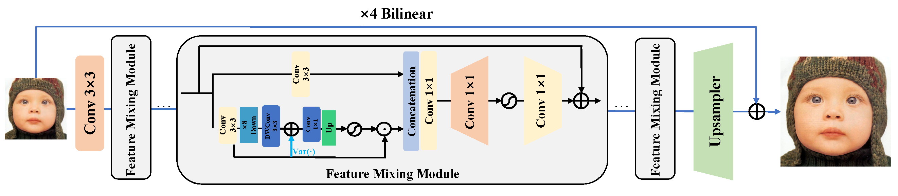

# [NTIRE 2025 Challenge on Efficient Super-Resolution](https://cvlai.net/ntire/2025/) @ [CVPR 2025](https://cvpr2025.thecvf.com/)

### 📖 SAFMNv3: Simple Feature Modulation Network for Real-Time Image Super-Resolution

---
<p align="center">
  
</p>

*An overview of the proposed SAFMNv3.*


### How to test the model?

1. Run the [`run.sh`] script (./run.sh)
    ```bash
    CUDA_VISIBLE_DEVICES=0 python test_demo.py --data_dir [path to your data dir] --save_dir [path to your save dir] --model_id 23
    ```
    - Be sure the change the directories `--data_dir` and `--save_dir`.

   
### How to calculate the number of parameters, FLOPs, and activations

```python
    from utils.model_summary import get_model_flops, get_model_activation
    from models.team19_SAFMNv3 import SAFMN_NTIRE25
    model = SAFMN_NTIRE25(dim=40, num_blocks=6, ffn_scale=1.5, upscaling_factor=4)
    
    input_dim = (3, 256, 256)  # set the input dimension
    activations, num_conv = get_model_activation(model, input_dim)
    activations = activations / 10 ** 6
    print("{:>16s} : {:<.4f} [M]".format("#Activations", activations))
    print("{:>16s} : {:<d}".format("#Conv2d", num_conv))

    flops = get_model_flops(model, input_dim, False)
    flops = flops / 10 ** 9
    print("{:>16s} : {:<.4f} [G]".format("FLOPs", flops))

    num_parameters = sum(map(lambda x: x.numel(), model.parameters()))
    num_parameters = num_parameters / 10 ** 6
    print("{:>16s} : {:<.4f} [M]".format("#Params", num_parameters))
```

2. Efficiency comparisons

We test FLOPs, Activations and memory on LR images of size 256×256 using official test code.
Runtime is performed on an RTX3090 with Pytorch1.11.

| Model | (x4) DIV2K_val | Params(G) | FLOPs(G) | Activations(M) | GPU Memory(M) | Runtime(ms) | 
| :-----| :-----:   | :-----:    | :-----:   | :-----:  | :-----:        | :-----: | 
| RLFN | 26.96| 0.317| 19.70| 80.05 | 468.77 | 16.18 |
| EFDN | 26.94| 0.276| 16.70 | 111.12 | 666.26 | 11.55 |
| SAFMNv3 |26.90| 0.145 | 9.52 | 76.69 | 303.60 | 6.70|
